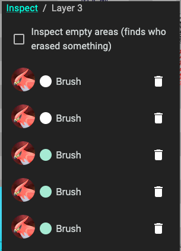

# Drawing tools
The main brushes you will be using are the brush and the circles brush.
There's also a eraser, a line tool and a image tool.

## Brush
The brush is a rather simple, pressure sensitive vector brush. 
Meaning, a single stroke will have a single opacity and won't overlap with itself.

## Circles brush
The circles brush is a bit more advanced, as the name suggests it uses circles
to create the stroke. It's also pressure sensitive and has some more settings like
hardness and spacing.

## Eraser
The eraser currently uses the Brush tool internally, but we plan on also adding a
circles eraser.

## Line tool
The line tool is a simple line tool, it's not pressure sensitive and has no special settings.

## Image tool
The image tool currently is only available for moderators, to prevent abuse.

# Other tools
There are a couple helper tools: Eyedropper, inspect tool and selection tool.

## Eyedropper
The eyedropper tool allows you to pick a color from the canvas.
You can also use right click to use it.

## Inspect tool
The inspect tool allows you to find out who drew a specific stroke.
It's currently not very intuitive, but we plan on improving it.
Finding who drew something:
1. Select the inspect tool.
2. Click on the stroke you want to inspect.

Say we're inspecting this image by krowphay:

If we click on the arrow, it'll show all the strokes on the top most layer where 
something intersects with where we clicked:

If you have the rights to do so, you'll be able to delete single strokes from here.
If you're not curious about the strokes on layer 2 but below, you can click "Inspect" in the tool layer
and it'll show you a list of all layers where something intersects with where you clicked.

You can select each layer and see who drew there. Clicking the profile image will show more info about the user.

### Finding who erased something
If someone's art was erased, you can use the inspect tool to find out who did it.
1. Select the inspect tool.
2. In the tool window, select "Inspect empty areas".
3. It'll now show all possible layers in the overview and you'll have 
   to manually click each to see where the eraser was used.

## Selection tool
The selection tool is quite simple. Select it, drag what you would like to select
and then you can download or post it to the gallery.
